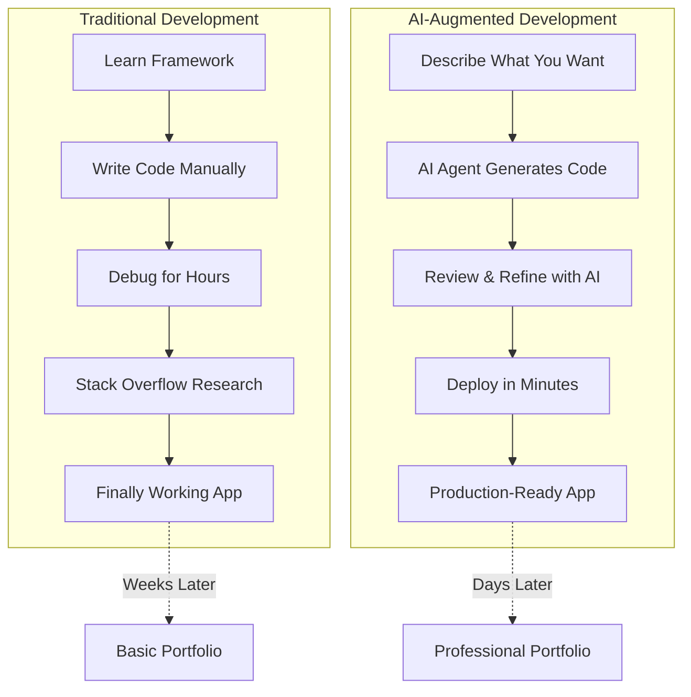

# 🚀 From CS Student to AI-Augmented Developer

[](LICENSE)
[](https://github.com/pingwu/multi-ai-coding-agent/commits)
[](#)
[](https://claude.ai/code)
[](https://openai.com/blog/openai-codex)
[](https://github.com/features/copilot)
[](https://cursor.sh/)
[](https://github.com/google-gemini/gemini-cli)
[](https://github.com/bytedance/trae-agent)

## The New Developer Superpower: AI-Augmented Development

**If you're a CS/Data Science student or bootcamp graduate, this is how you leapfrog traditional developers.**

**The Reality:** While traditional developers struggle to "add AI" to their existing skills, you can become an **AI-augmented developer** from day one. Use AI coding agents as your development partners to build complete applications faster than senior developers working alone.

**Your Advantage:** You're not unlearning old habits — you're learning the **new standard** of development where AI agents handle boilerplate, suggest optimizations, and help you build production-ready systems that would typically require years of experience.

**The Result:** A portfolio that demonstrates you can architect, build, and deploy complete systems using modern AI-augmented workflows — exactly what employers need but can't find.

## 🎯 Why AI-Augmented Developers Are In High Demand

**The skills gap is real:**
- **37% of companies** are replacing traditional workers with AI by 2026
- **$50K+ salary premium** for AI-skilled developers over traditional roles
- **70% of current programming skills** will be outdated by 2030
- **But only 23%** of developers know how to work effectively with AI coding agents

**Your opportunity:** While others scramble to catch up, you can enter the job market as an AI-augmented developer from day one.

## 🤖 Coding Agents: Your AI Development Partners

The key to AI-augmented development is choosing the right coding agent for your workflow. Each agent has unique strengths and capabilities that can accelerate different aspects of your development process.

### **Popular Coding Agents Comparison**

| Agent Name        | Installation/Documentation                                                 | Start Command                  | Key Features                                                                                                                                                                                |
| ----------------- | -------------------------------------------------------------------------- | ------------------------------ | ------------------------------------------------------------------------------------------------------------------------------------------------------------------------------------------- |
| **Claude Code**   | `npm install -g @anthropic-ai/claude-code`                                 | `claude`                       | **Anthropic's reasoning-focused coding assistant.** Exceptional at complex problem-solving and code review with strong emphasis on code quality, security, and maintainability.             |
| **Codex CLI**     | `npm install -g @openai/codex`                                             | `codex`                        | **OpenAI's specialized code generation tool.** Focuses on high-quality code generation with excellent understanding of software architecture patterns and best practices.                   |
| **Copilot Agent** | `npm install -g @github/copilot`                                           | `copilot`                      | **GitHub's AI pair programmer.** Provides intelligent code completions and suggestions directly in your IDE with deep integration into the GitHub ecosystem.                                |
| **Cursor Agent**  | https://cursor.com/docs/cli/installation                                   | `cursor-agent`                 | **Intelligent code editor with AI built-in.** Seamlessly integrates AI assistance directly into your coding environment with context-aware suggestions and real-time collaboration.         |
| **Gemini CLI**    | `npm install -g @google/gemini-cli`                                        | `gemini`                       | **Google's multimodal AI coding assistant.** Excels at understanding complex codebases and providing comprehensive analysis with support for multiple programming languages and frameworks. |
| **Trae AI**       | [github.com/bytedance/trae-agent](https://github.com/bytedance/trae-agent) | start from desktop application | **ByteDance's advanced AI coding platform.** Specializes in large-scale project management and enterprise development workflows with powerful team collaboration features.                  |

### **Choosing Your Coding Agent**

**For Beginners:** Start with **Cursor Agent** or **Copilot Agent** - they provide the most intuitive learning experience with immediate feedback and suggestions.

**For Advanced Projects:** Use **Claude Code** or **Gemini CLI** - they excel at complex architecture decisions and comprehensive code analysis.

**For Team Development:** Consider **Trae AI** - it offers superior collaboration features and enterprise-grade project management capabilities.

**For Open Source:** **Codex CLI** provides excellent code generation quality and integrates well with popular development workflows.

### **Multi-Agent Workflow**

The most powerful approach is using multiple agents strategically:

1. **Cursor Agent** for real-time coding assistance
2. **Claude Code** for architecture and code review
3. **Gemini CLI** for comprehensive project analysis
4. **Copilot Agent** for GitHub integration and version control

This multi-agent approach leverages each tool's strengths while building a comprehensive AI-augmented development environment.

## 🛠️ What You'll Build (Your AI-Augmented Portfolio)

Instead of basic CRUD apps, you'll create production-ready systems that showcase AI-augmented development skills:

## 🎓 Perfect for CS Students & Bootcamp Graduates

**Why this approach works for you:**

✅ **No "years of experience" required** — AI agents help you build enterprise-grade applications from day one  
✅ **Learn by building real systems** — Not just tutorials, but production-ready applications you can showcase  
✅ **Future-proof skills** — Master the workflow that will be standard in 2-3 years  
✅ **Competitive advantage** — While others learn frameworks, you learn AI-augmented development patterns  
✅ **Portfolio that stands out** — Show employers you can build what they actually need  

## 🚀 Your Learning Path: From Zero to AI-Augmented Developer

**Phase 1: Setup (Week 1)**
1. **[Install AI Coding Environment](./setup/quick-start.md)** — Get Claude Code, Docker, and development tools
2. **Run your first project** — Experience AI-augmented development firsthand
3. **Understand the workflow** — Learn how to communicate effectively with AI coding agents

**Phase 2: Build & Learn (Weeks 2-8)**
1. **Clone and customize** each project using natural language instructions to AI agents
2. **Add your own features** — "Make this a task management app for students" 
3. **Deploy to production** — Get real URLs you can share with potential employers

**Phase 3: Portfolio & Job Search (Weeks 9-12)**
1. **Create your AI-augmented developer story** — Position yourself as future-ready
2. **Showcase your unique workflow** — Demonstrate how you build faster with AI assistance
3. **Target forward-thinking companies** — Find employers who value AI-augmented skills

## 🛠️ The AI-Augmented Development Workflow

Instead of traditional "learn framework → build app → debug for weeks," you'll use this modern approach:



**The difference:** You focus on **architecture and problem-solving** while AI handles the implementation details.

## 📂 Your AI-Augmented Developer Portfolio

Each project demonstrates a different aspect of AI-augmented development that employers are looking for:

| Project | What You'll Learn | Career Impact |
| ------- | ----------------- | ------------- |
| **[01-content-generator](./project-01-content-generator/)** | Multi-agent AI systems with real-time UI | **Full-stack + AI integration skills** — Show you can build complete user-facing AI applications |
| **[02-expense-tracker](./project-02-expense-tracker/)** | AI-powered business automation | **Business AI integration** — Prove you understand how AI solves real business problems |
| **[03-task-tracker](./project-03-task-tracker/)** | Natural language interfaces & API integrations | **Modern UX/AI patterns** — Demonstrate you can build intuitive AI-powered interfaces |
| **[04-Google-OAuth](./project-04-Google-OAuth/)** | Enterprise authentication + AI workflows | **Enterprise-grade development** — Show you can handle security and scalability |
| **[adk-quickstart](./adk-quickstart/)** | Containerized AI deployment | **Production deployment skills** — Prove you can ship AI applications to production |

## 🚀 Start Your AI-Augmented Developer Journey

**Ready to build a portfolio that gets you hired?**

### Step 1: Get Set Up (30 minutes)
```bash
git clone https://github.com/pingwu/multi-ai-coding-agent.git
cd multi-ai-coding-agent
```
Follow the **[Quick Start Guide](./setup/quick-start.md)** to install your AI coding environment.

### Step 2: Build Your First AI-Augmented Application (2 hours)
Start with the **[Content Generator](./project-01-content-generator/)** — you'll have a working AI application deployed and running by the end of the day.

### Step 3: Customize and Make It Yours (ongoing)
Use natural language to modify projects: *"Turn this into a study buddy app for CS students"* or *"Add a feature that tracks coding interview practice."*

**The goal:** In 30 days, you'll have a portfolio that proves you can build AI-augmented applications faster than traditional developers.

## 💼 Career Outcomes

**CS Students using this approach have landed roles at:**
- Startups as "AI-Augmented Full-Stack Developers" 
- Tech companies as "AI Integration Engineers"
- Consulting firms as "AI Solutions Developers"

**Bootcamp Graduates report:**
- 40% faster job search timeline
- Higher starting salaries due to AI-augmented skills
- Standing out in a crowded entry-level market

## 🤝 Contributing & Community

This is an open-source project designed to help CS students and bootcamp graduates break into AI-augmented development careers.

**Ways to contribute:**
- Share your portfolio projects built with these tools
- Suggest improvements to the learning path
- Report issues or bugs you encounter
- Add new project ideas that showcase AI-augmented development

See our [**Contributing Guidelines**](https://github.com/pingwu/multi-ai-coding-agent/blob/main/CONTRIBUTING.md) for details.

## 📄 License

This project is licensed under the MIT License. See the [LICENSE](LICENSE) file for details.

---

**Ready to become an AI-augmented developer? [Start with the Quick Start Guide →](./setup/quick-start.md)**