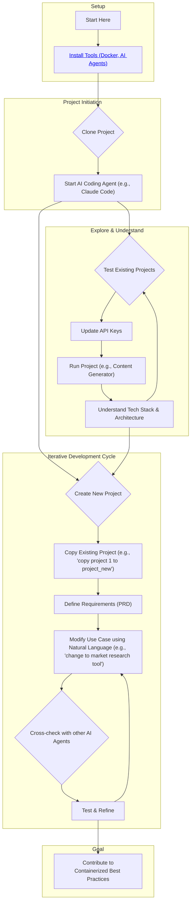

# 🤖 Multi-AI Coding Agent Projects

**Production-ready, multi-agent AI systems that you can clone, customize, and deploy in minutes.**

This repository provides a collection of self-contained, professional-grade AI applications built with a modern tech stack. It is designed for students, developers, and entrepreneurs who want to build and deploy AI solutions efficiently.

## 🚀 Getting Started

For a complete setup guide, please see the **[Quick Start Guide](./setup/quick-start.md)**.

## 🎯 Core Objectives

*   **Natural Language AI Development**: Extend and customize AI projects through conversational development.
*   **Enterprise-Grade Foundation**: Focus on business logic with a production-ready infrastructure stack.
*   **Scalable Enterprise Architecture**: Built for scaling with containerized deployment and API-first design.

## Workflow Overview

The diagram below illustrates the development workflow, from initial setup to running an application.

## 📂 The Projects

Each project is a complete, standalone application.

| Project                  | Description                                       | Status               |
| ------------------------ | ------------------------------------------------- | -------------------- |
| **01-content-generator** | Multi-agent content creation with a real-time UI. | ✅ **Ready**          |
| **02-expense-tracker**   | Automates business expense categorization.        | ✅ **Ready**          |
| **03-task-tracker**      | Natural-language task logging to Google Sheets.   | ✅ **Ready**         |
| **04-Google-OAuth**      | Team task tracker with Google OAuth integration.  | ✅ **Ready** |
| **adk-quickstart**       | Containerized Google ADK with custom chat frontend. | ✅ **Ready** |
| **05-cloud-deployment**  | Guides for deploying these projects to the cloud. | 🗓️ Nov 2025 Release |

For more details, see the README file within each project folder.

## 🤝 Contributing

We welcome contributions! Please see our [**Contributing Guidelines**](https://github.com/pingwu/multi-ai-coding-agent/blob/main/CONTRIBUTING.md) and [**Code of Conduct**](https://github.com/pingwu/multi-ai-coding-agent/blob/main/CODE_OF_CONDUCT.md).

## 📄 License

This project is licensed under the MIT License. See the [LICENSE](LICENSE) file for details.