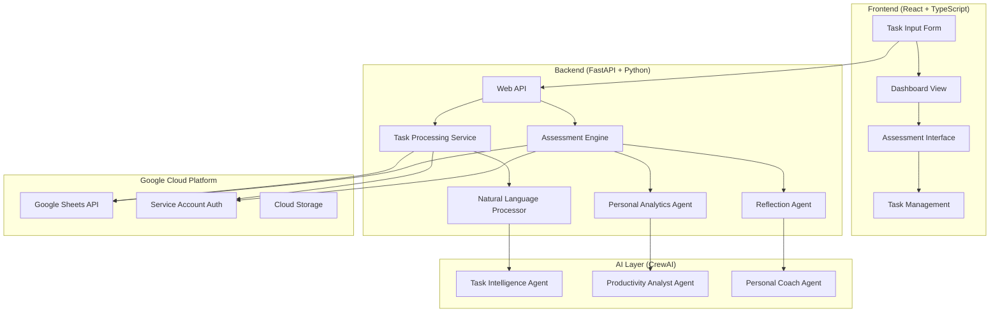

# 🧠 Personal Productivity Assistant - Product Requirements Document (PRD)

**Version**: 2.0 (Personal Focus)  
**Date**: September 2025  
**Status**: Draft  
**Owner**: MAS Course Development Team  

---

## 🎯 **Executive Summary**

**Personal Productivity Assistant** is an AI-powered habit-building tool that transforms natural language thoughts into organized, trackable goals with intelligent self-assessment. Using Google Sheets as a personal knowledge base and CrewAI for reflection analysis, it helps users document ideas effortlessly while maintaining focus on what matters most.

### **Core Value Propositions**
- **Effortless Capture**: "I want to write a blog about AI trends" → Automatically categorized and tracked
- **Habit Formation**: Build consistency in documenting thoughts and tracking progress  
- **Focus Maintenance**: AI helps identify what's truly important vs. nice-to-have
- **Self-Reflection**: Regular AI-powered assessments for personal growth
- **Future-Ready**: Foundation for a personal AI assistant that knows your patterns

---

## 🏢 **Business Objectives & Vision**

### **Primary Business Objective**
*"Create a personal productivity system that helps establish the habit of documenting thoughts and tracking progress while maintaining focus on the most important goals through AI-powered self-assessment."*

### **Personal Use Case Scenarios**
```
🧠 THOUGHT CAPTURE:
User: "I should write a blog about the future of AI in healthcare"
System: → Categorizes as "Content Creation"
        → Estimates effort (2-4 hours)
        → Suggests timeline (next 2 weeks)
        → Connects to existing AI/healthcare interests

📝 PROJECT TRACKING:
User: "Set up new development environment for the course project"
System: → Identifies as Technical Task
        → Breaks into sub-tasks automatically
        → Sets realistic completion timeline
        → Tracks against similar past tasks

🎯 GOAL MANAGEMENT:
User: "I want to be better at machine learning by end of year"
System: → Creates measurable milestones
        → Suggests specific learning resources
        → Tracks weekly progress
        → Provides AI-powered reflection prompts
```

### **Long-term Vision: Personal AI Assistant Foundation**
- **Phase 1**: Habit building through effortless task capture and tracking
- **Phase 2**: Pattern recognition and intelligent suggestions based on personal data
- **Phase 3**: Proactive AI assistant that understands individual work patterns and priorities
- **Phase 4**: Integration with calendar, email, and other productivity tools for holistic life management

---

## 👤 **Primary User Persona: The Self-Improving Professional**

### **Primary User: "Future You"**
- **Role**: Professional seeking systematic personal development
- **Challenge**: "I have lots of ideas but struggle to track them consistently"
- **Current Behavior**: 
  - Jots down ideas in random places (notes app, emails to self, sticky notes)
  - Starts many projects but loses track of progress
  - Difficulty prioritizing between competing interests
  - Inconsistent in self-reflection and goal assessment
- **Desired Outcomes**:
  - Consistent habit of documenting all thoughts and ideas
  - Clear visibility into what's actually important vs. distracting
  - Regular self-assessment without external pressure
  - Foundation for building a personal AI assistant
  - Better focus and completion rates on meaningful projects

### **Secondary Users: MAS Course Students**
- **Learning Goals**: Google Cloud Platform integration, natural language processing, personal productivity tools
- **Technical Focus**: GCP CLI usage, Google Sheets API, CrewAI for personal analysis
- **Portfolio Value**: Demonstrates practical AI application for personal productivity

---

## ⚡ **Core Features & Requirements**

### **🔌 F1: Natural Language Task Input**
**User Story**: *"As someone with lots of ideas, I want to quickly capture thoughts in natural language so I don't lose momentum while thinking."*

**Input Examples**:
```
"I want to write a blog about AI trends in 2025"
"Set up Docker environment for the new project"
"Learn more about LangGraph for complex workflows"
"Call Mom this weekend"
"Research Google Cloud Run pricing for deployment"
"Create presentation for team meeting next Tuesday"
```

**AI Processing**:
- **Category Detection**: Blog Idea, Technical Task, Learning Goal, Personal, Research, Presentation
- **Priority Assessment**: High/Medium/Low based on language cues ("urgent", "important", "when I have time")
- **Effort Estimation**: Small (< 1 hour), Medium (1-4 hours), Large (1+ days)
- **Timeline Suggestion**: Today, This Week, This Month, Someday/Maybe
- **Context Linking**: Connect to existing related tasks or goals

**Technical Implementation**:
```python
# Example CrewAI agent for task analysis
task_analyzer_agent = Agent(
    role="Personal Task Intelligence Analyst",
    goal="Transform natural language thoughts into structured, actionable tasks with appropriate categorization and priority",
    backstory="You are a personal productivity expert who understands how busy professionals think and work. You excel at identifying the true intent behind casual statements and organizing them for maximum effectiveness.",
    tools=[
        NaturalLanguageProcessor(),
        CategoryClassifier(), 
        PriorityAnalyzer(),
        EffortEstimator(),
        ContextLinker()
    ]
)
```

### **🗂️ F2: Intelligent Task Organization**
**User Story**: *"As someone juggling multiple interests, I want my tasks automatically organized so I can see patterns and maintain focus on what's important."*

**Auto-Categorization System**:
```
📝 CONTENT CREATION
- Blog ideas, writing projects, documentation

💻 TECHNICAL PROJECTS  
- Development tasks, learning goals, tool setup

🎯 PERSONAL GOALS
- Health, relationships, self-improvement

📊 PROFESSIONAL
- Work tasks, career development, networking

🧠 RESEARCH & LEARNING
- Study topics, courses, skill development

📅 TIME-SENSITIVE
- Deadlines, appointments, urgent items
```

**Smart Features**:
- **Pattern Recognition**: "You tend to have blog ideas on Sundays"
- **Workload Balancing**: "You have 4 technical projects - consider finishing one first"
- **Context Awareness**: Links related tasks automatically
- **Focus Recommendations**: Highlights most important items based on patterns

### **📊 F3: Personal Self-Assessment System**
**User Story**: *"As someone focused on continuous improvement, I want regular AI-powered reflection sessions so I can understand my patterns and progress without external judgment."*

**Assessment Triggers**:
- **On-Demand**: "Analyze my progress this month"
- **Weekly**: Every Sunday evening
- **Monthly**: First day of each month
- **Quarterly**: Personal review sessions
- **Yearly**: Annual reflection and goal setting

**Assessment Categories**:
```
🎯 GOAL PROGRESS ANALYSIS
- Completion rates by category
- Time estimation accuracy
- Priority alignment assessment

📈 PRODUCTIVITY PATTERNS  
- Most productive times/days
- Task completion consistency
- Procrastination indicators

💡 INSIGHT GENERATION
- Hidden productivity strengths
- Areas for improvement
- Suggested process optimizations

🔮 TREND PREDICTION
- Based on historical patterns
- Seasonal productivity cycles
- Goal achievement likelihood
```

**Sample Assessment Output**:
```
🧠 PERSONAL PRODUCTIVITY ASSESSMENT - SEPTEMBER 2025
━━━━━━━━━━━━━━━━━━━━━━━━━━━━━━━━━━━━━━━━━━━━━━━━━

📊 MONTH OVERVIEW:
✅ Completed: 23 tasks (85% completion rate)
🎯 Focus Area: Technical Projects (40% of time)
⭐ Strength: Consistent daily capture (28/30 days)
⚠️  Improvement Area: Blog writing (3 started, 0 finished)

🔍 KEY INSIGHTS:
• You're most productive Tuesday-Thursday mornings
• Technical tasks get completed 90% of the time
• Creative projects often get postponed (avg 2.3x)
• Weekend planning sessions improve weekly completion by 35%

💡 PERSONALIZED RECOMMENDATIONS:
1. Schedule blog writing for Tuesday mornings (your creative peak)
2. Limit concurrent creative projects to 2 maximum
3. Consider "Blog Sprint Fridays" - dedicate 2 hours exclusively
4. Your pattern: finish technical tasks first, then creative work flows better

🎯 OCTOBER GOALS SUGGESTION:
• Primary Focus: Complete 2 blog posts (realistic based on patterns)
• Technical: Finish Docker course + GCP deployment project
• Habit: Maintain 85%+ daily capture rate
• Experiment: Try "Creative Tuesdays" scheduling
```

### **🔄 F4: Task Update & Editing System**
**User Story**: *"As my priorities change, I want to easily update tasks and their status so my system stays current with my reality."*

**Update Methods**:
1. **Direct Google Sheets Editing**: Users can edit the sheet directly
2. **Natural Language Updates**: "Mark the Docker setup as completed"
3. **Web Interface**: Simple status updates and note additions
4. **Batch Processing**: "Update all blog tasks to low priority"

**Status Options**:
- **Not Started** (default for new tasks)
- **In Progress** (actively working)
- **Waiting** (blocked by something external)  
- **Completed** (finished)
- **Cancelled** (no longer relevant)
- **Someday/Maybe** (interesting but not active)

### **🌐 F5: Google Cloud Platform Integration** 
**User Story**: *"As a student learning cloud technologies, I want hands-on experience with GCP tools while building something personally useful."*

**Technical Learning Focus**:
- **Google Sheets API**: Read/write task data programmatically
- **Google Cloud CLI**: Setup and authentication via command line
- **Service Account Management**: Secure API access patterns
- **Google Cloud Functions**: Potential for serverless task processing
- **Google Cloud Storage**: Backup and historical data storage

**CLI-First Setup Approach**:
```bash
# Install Google Cloud CLI
curl https://sdk.cloud.google.com | bash
exec -l $SHELL  # Restart shell

# Authenticate and setup project
gcloud auth login
gcloud config set project your-productivity-project

# Create service account for app
gcloud iam service-accounts create productivity-app \
    --display-name="Personal Productivity Assistant"

# Generate and download credentials
gcloud iam service-accounts keys create ~/productivity-credentials.json \
    --iam-account=productivity-app@your-productivity-project.iam.gserviceaccount.com

# Enable required APIs
gcloud services enable sheets.googleapis.com
gcloud services enable drive.googleapis.com
```

**Why CLI-First Approach**:
- **Educational Value**: Students learn professional cloud workflows
- **Reproducible Setup**: Commands can be scripted and shared
- **Coding Agent Friendly**: AI agents can help debug CLI commands
- **Professional Skills**: Mirror real workplace cloud development practices

---

## 🎨 **User Interface Design**

### **Simple Task Input Form**

```
┌─────────────────────────────────────────────────────────┐
│ 🧠 CAPTURE YOUR THOUGHTS                                │
│                                                         │
│ ┌─────────────────────────────────────────────────────┐ │
│ │ What's on your mind?                                │ │
│ │                                                     │ │
│ │ I want to write a blog about AI trends in 2025     │ │
│ │                                                     │ │
│ │ [Tips: Be natural - "I should...", "Need to...",   │ │
│ │  "Research...", "Call...", "Fix..."]               │ │
│ └─────────────────────────────────────────────────────┘ │
│                                                         │
│ 🤖 [Smart Capture] 📝 [Quick Add] ⚙️ [Advanced]        │
│                                                         │
│ ✨ Recent captures (3):                                │
│ • Research Google Cloud Run pricing (Technical)        │
│ • Call Mom this weekend (Personal)                     │  
│ • Learn LangGraph basics (Learning)                    │
└─────────────────────────────────────────────────────────┘
```

### **Task Organization Dashboard**

```
┌─────────────────────────────────────────────────────────┐
│ 📊 YOUR PRODUCTIVITY OVERVIEW                           │
│                                                         │
│ 🎯 FOCUS THIS WEEK (3 items)                           │
│ ┌─────────────────────────────────────────────────────┐ │
│ │ ✅ Complete Docker course - Module 3 (In Progress) │ │
│ │ 📝 Blog: AI trends draft (Not Started)             │ │
│ │ 💻 Setup GCP project environment (Not Started)     │ │
│ └─────────────────────────────────────────────────────┘ │
│                                                         │
│ 📝 CONTENT IDEAS (5) 💻 TECHNICAL (8) 🧠 LEARNING (4)  │
│ 🎯 PERSONAL (3)      📅 THIS MONTH (12)                │
│                                                         │
│ 💡 AI INSIGHTS:                                        │
│ • You're 85% better at finishing technical tasks      │
│ • Tuesday mornings = peak productivity time            │
│ • Consider limiting concurrent creative projects       │
│                                                         │
│ [🧠 Run Assessment] [📊 View All Tasks] [⚙️ Settings]   │
└─────────────────────────────────────────────────────────┘
```

### **Self-Assessment Interface**

```
┌─────────────────────────────────────────────────────────┐
│ 🔍 PERSONAL PRODUCTIVITY ASSESSMENT                     │
│                                                         │
│ 📅 TIMEFRAME: September 2025 (Current Month)           │
│                                                         │
│ ┌─────────────────────────────────────────────────────┐ │
│ │ 🤖 AI Analysis in Progress...                       │ │
│ │ ✅ Task completion patterns (2.3s)                  │ │
│ │ 🔄 Productivity trends analysis (45s remaining)     │ │
│ │ ⏳ Personal insights generation (queued)            │ │
│ │ ⏳ Recommendations compilation (queued)             │ │
│ └─────────────────────────────────────────────────────┘ │
│                                                         │
│ 📊 QUICK STATS (Live):                                 │
│ • 23 tasks completed this month                        │
│ • 85% capture consistency (28/30 days)                 │
│ • Technical projects: 90% completion rate              │
│ • Creative projects: 45% completion rate               │
│                                                         │
│ 🧠 This analysis is for YOUR growth - no external      │
│ judgment, just insights to help you improve.           │
└─────────────────────────────────────────────────────────┘
```

---

## 🏗️ **Technical Architecture**

### **System Components**



### **Google Sheets Schema**

```
PERSONAL_TASKS_SHEET:
task_id | capture_date | raw_input | processed_title | category | priority | effort_size | status | due_date | completed_date | notes | context_links

ASSESSMENT_HISTORY_SHEET:  
assessment_id | date | timeframe | completion_rate | insights | recommendations | patterns_identified | goals_for_next_period

PRODUCTIVITY_METRICS_SHEET:
date | tasks_captured | tasks_completed | categories_active | focus_time_estimate | actual_work_patterns | mood_indicator
```

### **CrewAI Agent Configurations**

```python
# Personal Task Intelligence Agent
task_intelligence_agent = Agent(
    role="Personal Productivity Intelligence Analyst",
    goal="Transform natural language thoughts into well-organized, actionable personal tasks",
    backstory="""You are an expert in personal productivity who understands how creative 
    professionals think and work. You excel at identifying true priorities from casual 
    thoughts and organizing them for maximum personal effectiveness.""",
    tools=[
        NaturalLanguageProcessor(),
        PersonalCategoryClassifier(),
        EffortEstimator(),
        PriorityAnalyzer(),
        ContextLinker()
    ]
)

# Personal Productivity Coach Agent  
productivity_coach_agent = Agent(
    role="Personal Productivity Coach and Reflection Specialist",
    goal="Provide insightful, non-judgmental personal productivity analysis and actionable recommendations",
    backstory="""You are a personal productivity coach focused on individual growth 
    and habit formation. You help people understand their patterns, celebrate progress, 
    and make realistic improvements without external pressure or comparison.""",
    tools=[
        PatternAnalyzer(),
        ProgressTracker(),
        ReflectionGenerator(),
        HabitAnalyzer(),
        PersonalRecommendationEngine()
    ]
)
```

### **API Endpoints**

```python
# Core API Design
@app.post("/api/capture")
async def capture_thought(request: ThoughtCaptureRequest) -> TaskResponse

@app.get("/api/dashboard")  
async def get_dashboard() -> DashboardData

@app.post("/api/assessment")
async def run_assessment(timeframe: str) -> AssessmentResults

@app.put("/api/tasks/{task_id}")
async def update_task(task_id: str, updates: TaskUpdate) -> TaskResponse

@app.get("/api/insights")
async def get_personal_insights() -> PersonalInsights
```

---

## 📋 **Implementation Plan**

### **Phase 1: Foundation (Week 1-2)**
- [ ] **Google Cloud Setup**: CLI authentication, service accounts, Sheets API access
- [ ] **Basic Task Capture**: Simple form with natural language input
- [ ] **Google Sheets Integration**: Write captured tasks to personal sheet
- [ ] **Basic Web Interface**: Task input form and simple task list view

### **Phase 2: Intelligence Layer (Week 3-4)**  
- [ ] **Natural Language Processing**: CrewAI agent for task analysis
- [ ] **Smart Categorization**: Auto-detect task types and priorities
- [ ] **Dashboard Creation**: Organized view of tasks by category and status
- [ ] **Task Management**: Status updates and basic editing capabilities

### **Phase 3: Assessment System (Week 5-6)**
- [ ] **Personal Analytics**: Pattern recognition and progress tracking  
- [ ] **Assessment Engine**: AI-powered reflection and insights generation
- [ ] **Trend Analysis**: Historical data analysis and productivity patterns
- [ ] **Recommendation System**: Personalized productivity suggestions

### **Phase 4: Polish & Deployment (Week 7-8)**
- [ ] **User Experience Polish**: Refined interface and smooth workflows
- [ ] **Performance Optimization**: Fast response times and efficient data handling
- [ ] **Documentation**: Comprehensive setup and usage guides
- [ ] **Deployment**: Production-ready containerized application

### **Success Metrics**
- **Daily Usage**: 80% consistent daily task capture
- **Assessment Engagement**: Monthly self-assessment completion
- **Productivity Improvement**: Measurable increases in task completion rates
- **Habit Formation**: 30-day continuous usage demonstrates habit establishment

---

## 🎯 **Educational Learning Objectives**

### **Technical Skills**
- **Google Cloud Platform**: CLI usage, service accounts, API integration
- **Natural Language Processing**: CrewAI agents for text analysis
- **Personal Data Management**: Privacy-focused data handling
- **Full-Stack Development**: React frontend with Python backend
- **API Integration**: Google Sheets as database, real-time sync

### **Productivity & Life Skills**  
- **Habit Formation**: Build consistent tracking and reflection practices
- **Self-Awareness**: Understand personal productivity patterns
- **Goal Management**: Transform ideas into actionable, trackable items
- **Reflection Practice**: Regular self-assessment without external judgment
- **Personal AI**: Foundation for building personalized AI assistant

### **Professional Development**
- **Portfolio Quality**: Production-ready personal productivity tool
- **Cloud Skills**: Real Google Cloud Platform experience
- **AI Integration**: Practical multi-agent system implementation
- **Product Thinking**: Build something personally valuable and useful

---

## 🚀 **Future Personal AI Assistant Evolution**

### **Version 2.0: Pattern Recognition**
- **Predictive Task Suggestions**: Based on historical patterns
- **Optimal Scheduling**: AI-powered time and energy management
- **Context Awareness**: Connect tasks with calendar, location, mood
- **Smart Notifications**: Right task, right time, right energy level

### **Version 3.0: Proactive Assistant**
- **Email Integration**: Auto-capture tasks from emails and messages
- **Calendar Coordination**: Automatic scheduling based on task priorities
- **Meeting Intelligence**: Extract action items and follow-ups
- **Life Integration**: Connect work, personal, and learning goals

### **Version 4.0: Holistic Life Management**
- **Multi-Device Sync**: Mobile, desktop, voice interface integration
- **Collaboration Features**: Share contexts without sharing personal data
- **Health Integration**: Energy levels, sleep patterns, productivity correlation
- **Long-term Planning**: Multi-year goal tracking and life direction guidance

---

## ✅ **Key Differentiators**

### **Personal vs. Professional Focus**
- **No External Pressure**: Built for self-improvement, not performance monitoring
- **Private Reflection**: Data stays in your Google Sheets, insights for you only
- **Habit Building**: Focus on consistency over perfection
- **Long-term Foundation**: Grows into comprehensive personal AI assistant

### **Technical Innovation**
- **Natural Language First**: Capture thoughts exactly as they occur
- **CLI-First Cloud Setup**: Professional development practices
- **Google Platform Deep Integration**: Real cloud development experience
- **CrewAI for Personal Analytics**: AI agents understand individual patterns

### **Educational Value**
- **Personally Meaningful**: Build something you'll actually use daily
- **Portfolio Ready**: Professional-quality code and cloud integration
- **Real Problem Solving**: Address genuine productivity and habit challenges
- **Scalable Foundation**: Extensible architecture for future enhancements

---

This redesigned PRD transforms Project 3 into a **personally meaningful productivity tool** that addresses your specific needs while providing excellent technical learning opportunities. The focus on habit building, self-reflection, and natural language input makes it both practically valuable and technically interesting for students to develop.

**Ready to start building your Personal AI Assistant foundation?** 🚀