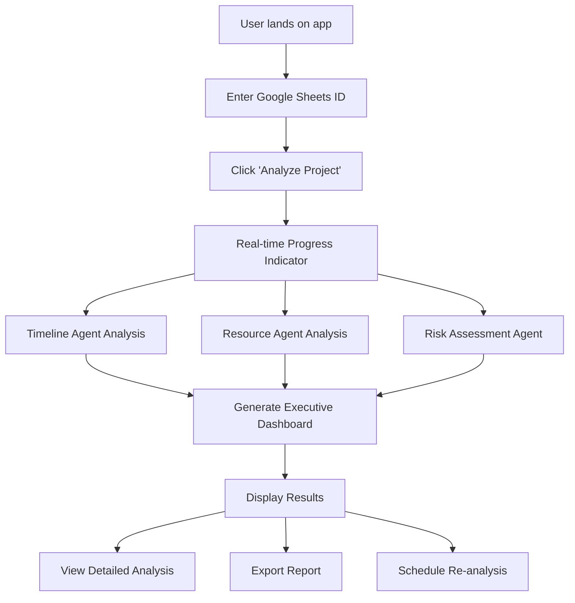
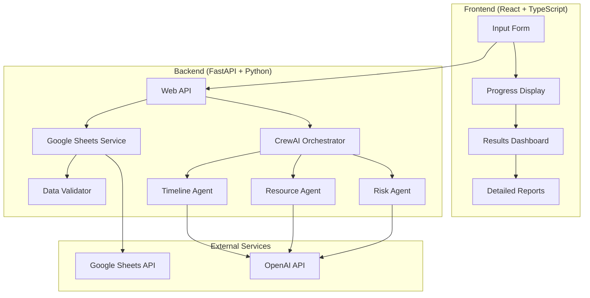

# 📊 Project Analyzer - Product Requirements Document (PRD)

**Version**: 1.0  
**Date**: September 2025  
**Status**: Draft  
**Owner**: MAS Course Development Team  

---

## 🎯 **Executive Summary**

**Project Analyzer** is an AI-powered project management intelligence tool that transforms Google Sheets project data into actionable risk assessments and strategic recommendations. Using a multi-agent CrewAI system, it provides project managers and teams with real-time insights to prevent project failures, optimize resource allocation, and improve delivery predictability.

### **Key Value Propositions**
- **Proactive Risk Detection**: Identify project risks before they become critical issues
- **Intelligent Resource Optimization**: Balance workloads and prevent team burnout  
- **Data-Driven Decision Making**: Transform spreadsheet data into strategic insights
- **Zero Setup Complexity**: Works with existing Google Sheets - no migration required
- **Multi-Agent AI Analysis**: Specialized AI agents for timeline, resource, and risk analysis

---

## 🏢 **Product Vision & Strategy**

### **Vision Statement**
*"Empower project managers and teams with AI-driven insights that turn project data into delivery success."*

### **Mission**
Transform the way teams manage projects by providing intelligent, proactive analysis that prevents delays, optimizes resources, and ensures successful project outcomes through accessible AI technology.

### **Strategic Goals**
1. **Democratize Project Intelligence**: Make advanced project analytics accessible to all teams
2. **Reduce Project Failure Rates**: Provide early warning systems for project risks
3. **Optimize Team Performance**: Help managers make data-driven resource decisions
4. **Accelerate Learning**: Teach students practical AI integration in business contexts

### **Success Metrics (OKRs)**
- **User Engagement**: 80% of users analyze projects weekly after first use
- **Risk Prevention**: 60% reduction in project delays for active users
- **User Satisfaction**: 4.5+ NPS score from project managers
- **Educational Impact**: 90% of students demonstrate competency in Google Sheets API integration

---

## 👥 **Target Audience & User Personas**

### **Primary Persona: Sarah - The Project Manager**
- **Role**: Software Project Manager at mid-size tech company
- **Experience**: 3-5 years managing development teams (5-15 people)
- **Pain Points**:
  - Spending 20% of time manually tracking project status in spreadsheets
  - Discovering risks too late to mitigate effectively
  - Difficulty visualizing complex project dependencies
  - Team members over/under-allocated without clear visibility
- **Goals**:
  - Proactive identification of project risks
  - Optimize team workload distribution
  - Generate executive-ready project reports
  - Reduce manual project tracking overhead
- **Technology Comfort**: Advanced Excel/Google Sheets user, basic API understanding

### **Secondary Persona: Alex - The Team Lead**
- **Role**: Engineering Team Lead / Senior Developer
- **Experience**: 5-8 years development, recently promoted to leadership
- **Pain Points**:
  - Balancing technical work with team management responsibilities
  - Limited project management training
  - Difficulty predicting team capacity and sprint completion
- **Goals**:
  - Quick project health visibility without extensive PM tools
  - Data-driven insights for team performance discussions
  - Early warning for technical debt and resource conflicts

### **Educational Persona: Jordan - The MAS Student**
- **Role**: Computer Science student learning multi-agent systems
- **Experience**: Intermediate Python, basic AI/ML knowledge
- **Learning Goals**:
  - Understand Google API integration patterns
  - Learn multi-agent system coordination
  - Build production-ready business intelligence tools
  - Gain experience with real project management challenges

---

## 🔍 **Market Analysis**

### **Current Solutions & Competitive Landscape**

| Solution | Strengths | Weaknesses | Our Advantage |
|----------|-----------|------------|---------------|
| **Jira/Linear** | Full-featured PM tools | Complex setup, expensive, overkill for many teams | Zero setup, works with existing sheets |
| **Monday.com** | Visual project boards | Requires data migration, subscription cost | No migration, AI-powered insights |
| **Asana** | Good task management | Limited risk analysis, manual reporting | Automated risk detection, intelligent recommendations |
| **Microsoft Project** | Enterprise-grade planning | Complex, expensive, steep learning curve | Simple interface, immediate insights |
| **Custom Dashboards** | Tailored to specific needs | Requires technical expertise, high maintenance | Pre-built intelligence, self-updating |

### **Market Opportunity**
- **SME Project Management**: $4.3B market with 40% using spreadsheets for project tracking
- **AI-Powered Analytics**: Growing 25% annually as teams seek competitive advantages
- **Google Workspace Integration**: 3B+ users worldwide with extensive Sheets adoption
- **Education Technology**: $350B market with increasing focus on practical AI skills

---

## ⚡ **Core Features & Functional Requirements**

### **MVP Feature Set (Version 1.0)**

#### **🔌 F1: Google Sheets Integration**
**User Story**: *"As a project manager, I want to connect my existing Google Sheets project tracker so that I don't have to migrate data to a new system."*

**Requirements**:
- Accept Google Sheets ID via simple web form
- Support standard project schema (tasks, timelines, resources, dependencies)
- Read-only access with clear permission requirements
- Handle sheets with 100-1000+ rows efficiently
- Provide clear error messages for malformed data

**Acceptance Criteria**:
- [ ] User can input Google Sheets URL or ID
- [ ] System validates sheet structure and provides helpful feedback
- [ ] Handles common spreadsheet variations (different column orders, extra columns)
- [ ] Processes sheets with up to 1000 rows in <30 seconds
- [ ] Clear error messages for access denied, malformed data, or network issues

#### **🤖 F2: Multi-Agent Risk Analysis**
**User Story**: *"As a project manager, I want AI agents to analyze my project data and identify risks I might have missed so I can take proactive action."*

**Requirements**:
- **Timeline Analyzer Agent**: Identify schedule risks, critical path issues, deadline conflicts
- **Resource Analyst Agent**: Detect workload imbalances, capacity constraints, skill mismatches  
- **Risk Assessor Agent**: Synthesize findings into actionable recommendations with priority levels
- Real-time processing with progress indicators
- Consistent analysis methodology across different project types

**Agent Specifications**:

```python
# Timeline Analyzer Agent
AGENT_CONFIG = {
    "role": "Project Timeline Risk Specialist",
    "goal": "Identify schedule risks and critical path bottlenecks that could delay project delivery",
    "backstory": "Former senior project manager with 10+ years experience delivering software projects on time. Expert in critical path analysis and resource optimization.",
    "tools": ["date_calculator", "dependency_analyzer", "timeline_visualizer"],
    "max_iterations": 3,
    "allow_delegation": False
}

# Resource Analyst Agent  
AGENT_CONFIG = {
    "role": "Team Capacity and Workload Expert", 
    "goal": "Assess resource allocation, identify bottlenecks, and optimize team productivity",
    "backstory": "Operations manager who has prevented team burnout and optimized productivity across 50+ engineering teams. Specializes in capacity planning and workload distribution.",
    "tools": ["capacity_calculator", "workload_analyzer", "team_optimizer"],
    "max_iterations": 3,
    "allow_delegation": False
}

# Risk Assessor Agent
AGENT_CONFIG = {
    "role": "Project Risk Management Consultant",
    "goal": "Generate prioritized, actionable recommendations to mitigate identified project risks", 
    "backstory": "Management consultant who has saved 200+ projects from failure through data-driven risk assessment and strategic intervention.",
    "tools": ["risk_prioritizer", "recommendation_engine", "impact_calculator"],
    "max_iterations": 5,
    "allow_delegation": True
}
```

**Acceptance Criteria**:
- [ ] Each agent produces specific, actionable findings within their domain
- [ ] Analysis completes within 2 minutes for typical projects (50-200 tasks)
- [ ] Consistent risk scoring methodology (1-10 scale with clear criteria)
- [ ] Agents coordinate to avoid conflicting recommendations
- [ ] Progress indicators show analysis status in real-time

#### **📊 F3: Executive Dashboard Report**
**User Story**: *"As a project manager, I want a clear executive summary of project health so I can quickly communicate status to leadership."*

**Requirements**:
- **Project Health Score**: Single metric (0-100) summarizing overall project status
- **Risk Summary**: High/Medium/Low risk item counts with clear visual indicators
- **Timeline Forecast**: Estimated completion date with confidence intervals
- **Resource Utilization**: Team capacity analysis with optimization recommendations
- **Trend Analysis**: Progress velocity and prediction accuracy over time

**Report Structure**:
```
🎯 PROJECT HEALTH DASHBOARD
━━━━━━━━━━━━━━━━━━━━━━━━━━━━━━━━

📈 Overall Health Score: 73/100 (Good)
🎯 Forecast Completion: Jan 15, 2025 (+3 days from plan)
👥 Team Utilization: 82% (Optimal: 70-85%)

RISK SUMMARY:
🚨 Critical (2): Authentication API delay, Database schema bottleneck
⚠️  High (5): Frontend integration timing, Testing resource gap
✅ Medium (8): Documentation tasks, UI polish items
✅ Low (15): Minor bug fixes, code review items

IMMEDIATE ACTIONS REQUIRED:
1. Assign additional developer to authentication API (saves 4 days)
2. Parallel database schema review with client (saves 2 days)  
3. Schedule testing resource allocation meeting (prevents future risk)

TREND INDICATORS:
📈 Velocity: 85% of estimated (improving from 78% last week)
🎯 Accuracy: Estimates within 15% for 80% of completed tasks
⚡ Blockers: Average resolution time 1.2 days (target: <1 day)
```

**Acceptance Criteria**:
- [ ] Dashboard loads in <5 seconds after analysis completion
- [ ] Health score calculation is transparent and consistent
- [ ] Risk categorization follows clear, documented criteria
- [ ] Recommendations are specific, actionable, and prioritized
- [ ] Visual indicators are color-blind accessible

#### **🔍 F4: Detailed Risk Analysis Report**
**User Story**: *"As a team lead, I want detailed risk analysis with specific recommendations so I can take targeted action on the highest-impact issues."*

**Requirements**:
- **Risk Details**: Each risk with description, impact assessment, probability, timeline
- **Root Cause Analysis**: Why each risk exists and contributing factors
- **Mitigation Strategies**: Specific actions with effort estimates and success probability
- **Dependency Mapping**: Visual representation of task interdependencies and bottlenecks
- **Historical Context**: How current risks compare to previous analysis runs

**Detailed Report Format**:
```
🚨 CRITICAL RISK ANALYSIS
━━━━━━━━━━━━━━━━━━━━━━━━━━━━

RISK: Authentication API Development Delay
Impact: HIGH (affects 8 downstream tasks)
Probability: 85% (based on current progress rate)
Timeline Risk: +7 days to project completion

Root Cause Analysis:
• Complex OAuth integration taking 150% longer than estimated
• Developer assigned to 3 concurrent high-priority tasks
• Client requirements changed mid-development (scope creep)
• Third-party API documentation incomplete

Recommended Actions:
1. [HIGH IMPACT] Assign senior developer for 3 days (reduces risk by 70%)
   - Effort: 24 hours
   - Success Rate: 85%
   - Timeline Savings: 5 days

2. [MEDIUM IMPACT] Simplify OAuth scope for MVP (reduces complexity by 40%)
   - Effort: 4 hours planning
   - Success Rate: 90%  
   - Timeline Savings: 3 days

3. [LOW IMPACT] Schedule client requirements review meeting
   - Effort: 2 hours
   - Success Rate: 60%
   - Timeline Savings: 2 days (prevents future scope creep)

Dependency Impact:
• User Registration (blocked)
• Profile Management (80% blocked) 
• Admin Dashboard (40% blocked)
• Testing Phase (delayed start)

Historical Context:
Similar authentication risks in 3 previous projects:
• Average delay: 5.2 days when unaddressed
• 90% success rate with senior developer assignment
• 60% scope reduction effective in 4/5 cases
```

**Acceptance Criteria**:
- [ ] Each risk includes quantified impact assessment (days, tasks affected, cost)
- [ ] Recommendations are prioritized by ROI (impact vs effort)
- [ ] Success rates based on historical data or industry benchmarks
- [ ] Dependency visualization shows critical path clearly
- [ ] Report can be exported as PDF for sharing

---

## 🎨 **User Experience Design**

### **User Flow - Primary Path**



### **Interface Wireframes**

#### **Landing Page / Input Form**
```
┌─────────────────────────────────────────────────────────┐
│ 📊 PROJECT ANALYZER                                    │
│                                                         │
│ Transform your Google Sheets into intelligent project  │
│ insights with AI-powered risk analysis                 │
│                                                         │
│ ┌─────────────────────────────────────────────────────┐ │
│ │ Google Sheets URL or ID                             │ │
│ │ https://docs.google.com/spreadsheets/d/1ABC...      │ │
│ └─────────────────────────────────────────────────────┘ │
│                                                         │
│ [🔍 Analyze Project]                                    │
│                                                         │
│ Need help? Try our sample project template             │
│ ┌─────────────────────────────────────────────────────┐ │
│ │ 📋 Sample Project Data                              │ │
│ │ • Software Development Project                      │ │
│ │ • Marketing Campaign Timeline                       │ │
│ │ • Event Planning Checklist                         │ │
│ └─────────────────────────────────────────────────────┘ │
└─────────────────────────────────────────────────────────┘
```

#### **Analysis Progress Page**
```
┌─────────────────────────────────────────────────────────┐
│ 🔄 ANALYZING YOUR PROJECT                               │
│                                                         │
│ ┌─────────────────────────────────────────────────────┐ │
│ │ ✅ Data Import Complete (2.3s)                      │ │
│ │ 🔄 Timeline Agent Analysis... (45s remaining)       │ │
│ │ ⏳ Resource Analysis (queued)                       │ │
│ │ ⏳ Risk Assessment (queued)                         │ │
│ └─────────────────────────────────────────────────────┘ │
│                                                         │
│ 📊 Project Overview:                                    │
│ • 47 tasks identified                                   │
│ • 8 team members                                        │  
│ • 12 week timeline                                      │
│ • 5 major milestones                                    │
│                                                         │
│ 🤖 AI Agents are analyzing timeline dependencies,       │
│ resource allocation, and potential risks...             │
└─────────────────────────────────────────────────────────┘
```

#### **Executive Dashboard Results**
```
┌─────────────────────────────────────────────────────────┐
│ 📊 PROJECT HEALTH DASHBOARD                             │
│                                                         │
│ ┌──────────────┐ ┌──────────────┐ ┌──────────────────┐  │
│ │ Health Score │ │ Timeline     │ │ Team Utilization │  │
│ │      73      │ │ +3 days risk │ │       82%        │  │
│ │    /100      │ │ Jan 15, 2025 │ │   (Optimal)      │  │
│ └──────────────┘ └──────────────┘ └──────────────────┘  │
│                                                         │
│ 🚨 IMMEDIATE ACTION REQUIRED (2 items)                  │
│ ┌─────────────────────────────────────────────────────┐ │
│ │ • Authentication API: Assign senior dev (saves 4d) │ │  
│ │ • Database schema: Schedule client review (saves 2d│ │
│ └─────────────────────────────────────────────────────┘ │
│                                                         │
│ ⚠️  WATCH CLOSELY (5 items)                             │
│ ┌─────────────────────────────────────────────────────┐ │
│ │ • Frontend integration timing                       │ │
│ │ • Testing resource allocation                       │ │
│ │ • API documentation dependencies                    │ │
│ │ • Client feedback response delays                   │ │
│ │ • Database migration complexity                     │ │
│ └─────────────────────────────────────────────────────┘ │
│                                                         │
│ [📋 View Detailed Analysis] [📧 Email Report] [🔄 Re-run] │
└─────────────────────────────────────────────────────────┘
```

### **Design Principles**
- **Simplicity First**: Single-page workflow with progressive disclosure
- **Immediate Value**: Show project insights within first 10 seconds
- **Actionable Information**: Every piece of data leads to a specific action
- **Visual Hierarchy**: Use color, typography, and spacing to guide attention
- **Mobile Responsive**: Works effectively on tablets and mobile devices
- **Accessibility**: WCAG 2.1 AA compliance for screen readers and color contrast

---

## 🏗️ **Technical Architecture**

### **System Architecture Overview**



### **Backend Technical Specifications**

#### **Core Technologies**
- **Framework**: FastAPI 0.100+ (async/await support)
- **Language**: Python 3.11+ 
- **AI Framework**: CrewAI 0.177+ for multi-agent coordination
- **External APIs**: Google Sheets API v4, OpenAI API
- **Container**: Docker with multi-stage builds
- **Environment**: Docker Compose for local development

#### **API Endpoints**

```python
# API Specification
from fastapi import FastAPI
from pydantic import BaseModel

class ProjectAnalysisRequest(BaseModel):
    sheets_id: str
    analysis_type: str = "full"  # full, quick, timeline_only
    notify_webhook: Optional[str] = None

class ProjectAnalysisResponse(BaseModel):
    analysis_id: str
    status: str  # pending, processing, completed, failed
    project_summary: Optional[ProjectSummary] = None
    risks: Optional[List[Risk]] = None
    recommendations: Optional[List[Recommendation]] = None

# Endpoints
@app.post("/api/analyze")
async def start_analysis(request: ProjectAnalysisRequest) -> ProjectAnalysisResponse

@app.get("/api/analysis/{analysis_id}")
async def get_analysis_status(analysis_id: str) -> ProjectAnalysisResponse

@app.get("/api/analysis/{analysis_id}/report")
async def get_detailed_report(analysis_id: str) -> DetailedReport

@app.websocket("/ws/analysis/{analysis_id}")
async def analysis_progress_stream(websocket: WebSocket, analysis_id: str)
```

#### **CrewAI Agent Configuration**

```python
# agents/timeline_agent.py
from crewai import Agent, Task, Crew

timeline_agent = Agent(
    role="Project Timeline Risk Specialist",
    goal="Identify schedule risks, critical path issues, and timeline conflicts that could delay project delivery",
    backstory="""You are a senior project manager with 10+ years of experience delivering 
    software projects on time. You specialize in critical path analysis, dependency management, 
    and timeline risk assessment. You've successfully identified and mitigated timeline risks 
    in over 200 projects.""",
    tools=[
        CriticalPathAnalyzer(),
        DependencyMapper(), 
        TimelineRiskCalculator(),
        DateCalculator()
    ],
    verbose=True,
    max_execution_time=120,  # 2 minutes max
    allow_delegation=False
)

# agents/resource_agent.py  
resource_agent = Agent(
    role="Team Capacity and Workload Expert",
    goal="Assess resource allocation, identify capacity constraints, and optimize team productivity while preventing burnout",
    backstory="""You are an operations manager who has optimized team productivity across 
    50+ engineering teams. You specialize in capacity planning, workload distribution, 
    and resource optimization. You've prevented team burnout while increasing delivery 
    velocity by 35% on average.""",
    tools=[
        CapacityCalculator(),
        WorkloadAnalyzer(),
        SkillsMatcher(),
        TeamOptimizer()
    ],
    verbose=True,
    max_execution_time=120,
    allow_delegation=False  
)

# agents/risk_agent.py
risk_agent = Agent(
    role="Project Risk Management Consultant", 
    goal="Synthesize timeline and resource analysis into prioritized, actionable recommendations that prevent project failure",
    backstory="""You are a management consultant who has saved over 200 projects from 
    failure through data-driven risk assessment and strategic intervention. You specialize 
    in translating complex project data into clear executive recommendations with proven ROI.""",
    tools=[
        RiskPrioritizer(),
        RecommendationEngine(), 
        ImpactCalculator(),
        HistoricalAnalyzer()
    ],
    verbose=True,
    max_execution_time=180,  # 3 minutes max
    allow_delegation=True
)
```

#### **Google Sheets Integration**

```python
# services/sheets_service.py
from google.oauth2.service_account import Credentials
from googleapiclient.discovery import build

class SheetsService:
    def __init__(self, credentials_path: str):
        self.credentials = Credentials.from_service_account_file(
            credentials_path,
            scopes=['https://www.googleapis.com/auth/spreadsheets.readonly']
        )
        self.service = build('sheets', 'v4', credentials=self.credentials)
    
    async def read_project_data(self, sheets_id: str) -> ProjectData:
        """
        Read and validate project data from Google Sheets
        Expected schema: project_schema.md
        """
        try:
            # Read main project tasks sheet
            result = self.service.spreadsheets().values().get(
                spreadsheetId=sheets_id,
                range='project_tasks!A1:M1000'  # Adjust range as needed
            ).execute()
            
            # Validate and transform data
            return self.transform_sheets_data(result.get('values', []))
            
        except Exception as e:
            raise SheetsAPIError(f"Failed to read sheets data: {str(e)}")
    
    def validate_schema(self, data: List[List]) -> bool:
        """Validate that sheets data matches expected project schema"""
        required_columns = [
            'item_id', 'title', 'status', 'start_date', 'due_date', 
            'assignee', 'priority', 'progress_pct', 'estimated_hours'
        ]
        
        if not data or len(data) < 1:
            return False
            
        headers = [col.lower().strip() for col in data[0]]
        return all(col in headers for col in required_columns)
```

### **Frontend Technical Specifications**

#### **Technology Stack**
- **Framework**: React 18+ with TypeScript
- **Build Tool**: Vite for fast development and builds
- **Styling**: CSS Modules with design system
- **State Management**: React Query for server state, React Context for UI state
- **Real-time Updates**: WebSocket connection for analysis progress
- **Charts**: Chart.js or D3.js for risk visualization
- **Testing**: Jest + React Testing Library

#### **Component Architecture**

```typescript
// components/ProjectAnalyzer.tsx
interface ProjectAnalyzerProps {
  onAnalysisComplete: (results: AnalysisResults) => void;
}

const ProjectAnalyzer: React.FC<ProjectAnalyzerProps> = ({ onAnalysisComplete }) => {
  const [sheetsId, setSheetsId] = useState('');
  const [analysisId, setAnalysisId] = useState<string | null>(null);
  const [stage, setStage] = useState<'input' | 'analyzing' | 'results'>('input');
  
  // WebSocket connection for real-time updates
  const { analysisStatus, progress } = useAnalysisWebSocket(analysisId);
  
  const startAnalysis = async () => {
    const response = await fetch('/api/analyze', {
      method: 'POST',
      headers: { 'Content-Type': 'application/json' },
      body: JSON.stringify({ sheets_id: sheetsId })
    });
    
    const { analysis_id } = await response.json();
    setAnalysisId(analysis_id);
    setStage('analyzing');
  };

  return (
    <div className="project-analyzer">
      {stage === 'input' && (
        <InputForm 
          sheetsId={sheetsId}
          onSheetsIdChange={setSheetsId}
          onStartAnalysis={startAnalysis}
        />
      )}
      
      {stage === 'analyzing' && (
        <AnalysisProgress 
          progress={progress}
          status={analysisStatus}
          onComplete={() => setStage('results')}
        />
      )}
      
      {stage === 'results' && analysisId && (
        <ResultsDashboard analysisId={analysisId} />
      )}
    </div>
  );
};

// hooks/useAnalysisWebSocket.ts
export const useAnalysisWebSocket = (analysisId: string | null) => {
  const [status, setStatus] = useState<AnalysisStatus>('pending');
  const [progress, setProgress] = useState<AnalysisProgress[]>([]);

  useEffect(() => {
    if (!analysisId) return;
    
    const ws = new WebSocket(`ws://localhost:8000/ws/analysis/${analysisId}`);
    
    ws.onmessage = (event) => {
      const data = JSON.parse(event.data);
      if (data.type === 'status_update') {
        setStatus(data.status);
      } else if (data.type === 'progress_update') {
        setProgress(prev => [...prev, data.progress]);
      }
    };
    
    return () => ws.close();
  }, [analysisId]);
  
  return { analysisStatus: status, progress };
};
```

### **Data Models**

```python
# models/project.py
from pydantic import BaseModel, Field
from typing import List, Optional
from datetime import datetime
from enum import Enum

class TaskStatus(str, Enum):
    NOT_STARTED = "NOT_STARTED"
    IN_PROGRESS = "IN_PROGRESS"
    BLOCKED = "BLOCKED" 
    COMPLETED = "COMPLETED"

class Priority(str, Enum):
    LOW = "LOW"
    MEDIUM = "MEDIUM"
    HIGH = "HIGH"
    CRITICAL = "CRITICAL"

class ProjectTask(BaseModel):
    item_id: str
    title: str
    status: TaskStatus
    start_date: datetime
    due_date: datetime
    assignee: str
    dependency_item_id: Optional[str] = None
    priority: Priority
    progress_pct: int = Field(ge=0, le=100)
    estimated_hours: float
    actual_hours: float = 0
    category: str
    notes: Optional[str] = None

class Risk(BaseModel):
    risk_id: str
    title: str
    description: str
    severity: str  # CRITICAL, HIGH, MEDIUM, LOW
    probability: float = Field(ge=0, le=1)
    impact_days: int
    affected_tasks: List[str]
    recommendations: List[str]
    estimated_cost: Optional[float] = None

class ProjectAnalysis(BaseModel):
    analysis_id: str
    sheets_id: str
    created_at: datetime
    project_summary: dict
    health_score: int = Field(ge=0, le=100)
    timeline_analysis: dict
    resource_analysis: dict
    risks: List[Risk]
    recommendations: List[dict]
    completion_forecast: datetime
```

### **Deployment Architecture**

#### **Development Environment**
```yaml
# docker-compose.yml
version: '3.8'

services:
  project-analyzer-backend:
    build: .
    ports:
      - "8000:8000"
    volumes:
      - .:/app
      - ./service_account.json:/app/service_account.json
    environment:
      - OPENAI_API_KEY=${OPENAI_API_KEY}
      - GOOGLE_SERVICE_ACCOUNT_PATH=/app/service_account.json
      - ENVIRONMENT=development
    command: uvicorn main:app --host 0.0.0.0 --port 8000 --reload

  project-analyzer-frontend:
    build: ./frontend
    ports:
      - "3000:3000"
    volumes:
      - ./frontend:/app
      - /app/node_modules
    environment:
      - REACT_APP_API_URL=http://localhost:8000
    depends_on:
      - project-analyzer-backend
```

#### **Production Deployment Options**
- **Google Cloud Run**: Serverless container deployment
- **Docker Compose**: Self-hosted on VPS or dedicated server
- **Kubernetes**: For high-availability enterprise deployment
- **Railway/Render**: Managed platform deployment for simplicity

---

## 📋 **Implementation Timeline**

### **Development Phases (8-week timeline)**

#### **Phase 1: Foundation & Setup (Week 1-2)**
**Goal**: Establish development environment and core architecture

- [ ] **Week 1**: Project setup and Google Sheets integration
  - Set up Docker development environment
  - Implement Google Sheets API authentication and data reading
  - Create basic data validation and error handling
  - Develop project schema validation logic

- [ ] **Week 2**: Backend API foundation
  - Build FastAPI application structure
  - Implement basic CRUD operations for analysis data
  - Create WebSocket endpoints for real-time updates
  - Set up database models and data persistence

**Deliverable**: Working Google Sheets data import with basic API

#### **Phase 2: AI Agent Development (Week 3-5)**
**Goal**: Develop and integrate multi-agent analysis system

- [ ] **Week 3**: Timeline Analysis Agent
  - Implement timeline risk detection algorithms
  - Create critical path analysis tools
  - Develop dependency mapping and conflict detection
  - Build deadline risk assessment logic

- [ ] **Week 4**: Resource Analysis Agent
  - Create capacity calculation and workload analysis
  - Implement skill matching and assignment optimization
  - Develop team utilization metrics and reporting
  - Build resource conflict detection

- [ ] **Week 5**: Risk Assessment Agent & Coordination
  - Implement risk prioritization and scoring algorithms
  - Create recommendation generation engine
  - Develop agent coordination and conflict resolution
  - Build comprehensive analysis orchestration

**Deliverable**: Complete multi-agent analysis system with integrated CrewAI workflow

#### **Phase 3: Frontend Development (Week 6-7)**
**Goal**: Build user-friendly interface and user experience

- [ ] **Week 6**: Core UI Components
  - Develop input form with Google Sheets ID validation
  - Create real-time progress indicators and WebSocket integration
  - Build executive dashboard with health score visualization
  - Implement basic risk summary display

- [ ] **Week 7**: Advanced UI & UX Polish
  - Create detailed risk analysis report views
  - Develop interactive charts and visualizations
  - Implement responsive design and mobile optimization
  - Add export functionality and report sharing

**Deliverable**: Complete user interface with full functionality

#### **Phase 4: Testing, Polish & Deployment (Week 8)**
**Goal**: Comprehensive testing, performance optimization, and production deployment

- [ ] **Week 8**: Testing & Production Readiness
  - Comprehensive unit and integration testing
  - Performance optimization and load testing
  - Security audit and vulnerability assessment
  - Production deployment and monitoring setup

**Deliverable**: Production-ready application with comprehensive documentation

### **Milestones & Success Criteria**

| Milestone | Success Criteria | Validation Method |
|-----------|------------------|-------------------|
| **M1: Data Integration** | Successfully read and parse 95% of test Google Sheets | Automated tests with 50+ sample sheets |
| **M2: AI Analysis** | Generate meaningful insights for 90% of projects | Manual review by 5 project managers |
| **M3: UI/UX Complete** | Users complete analysis workflow in <5 minutes | Usability testing with 10 users |
| **M4: Production Ready** | Handle 100 concurrent analyses, <30s response time | Load testing and performance benchmarks |

---

## 🧪 **Testing Strategy**

### **Testing Pyramid**

#### **Unit Tests (70% of test coverage)**
- **Google Sheets Service**: Data parsing, validation, error handling
- **Analysis Agents**: Individual agent logic, tool functions, decision algorithms
- **API Endpoints**: Request/response handling, authentication, data transformation
- **Utility Functions**: Date calculations, risk scoring, recommendation generation

```python
# Example unit tests
def test_timeline_agent_identifies_critical_path():
    sample_tasks = load_sample_project_data()
    agent = TimelineAgent()
    
    critical_path = agent.identify_critical_path(sample_tasks)
    
    assert len(critical_path) == 5
    assert critical_path[0].item_id == "TASK_001"
    assert agent.calculate_delay_risk(critical_path) > 0.7

def test_risk_prioritization_algorithm():
    risks = [
        Risk(severity="HIGH", probability=0.8, impact_days=7),
        Risk(severity="MEDIUM", probability=0.9, impact_days=3)
    ]
    
    prioritized = RiskAssessor.prioritize_risks(risks)
    
    assert prioritized[0].severity == "HIGH"  # High impact beats high probability
```

#### **Integration Tests (20% of test coverage)**
- **End-to-End Analysis Flow**: Complete workflow from Sheets input to final report
- **Multi-Agent Coordination**: Verify agents work together without conflicts
- **WebSocket Communication**: Real-time updates during analysis
- **External API Integration**: Google Sheets API reliability and error handling

```python
def test_complete_analysis_workflow():
    # Test full pipeline with real Google Sheets data
    sheets_id = "test_project_sheet_id"
    
    analysis_result = await run_complete_analysis(sheets_id)
    
    assert analysis_result.health_score >= 0 and analysis_result.health_score <= 100
    assert len(analysis_result.risks) > 0
    assert len(analysis_result.recommendations) > 0
    assert analysis_result.completion_forecast is not None
```

#### **UI/UX Tests (10% of test coverage)**  
- **Component Testing**: React components render correctly with various data states
- **User Flow Testing**: Critical user journeys work end-to-end
- **Accessibility Testing**: Screen reader compatibility, keyboard navigation
- **Cross-Browser Testing**: Chrome, Firefox, Safari, Edge compatibility

### **Performance Testing**
- **Load Testing**: 100 concurrent analyses without degradation
- **Stress Testing**: System behavior under extreme loads (500+ concurrent requests)
- **Scalability Testing**: Response time remains <30s with increasing data size
- **Memory Testing**: No memory leaks during extended operation

### **Security Testing**
- **Authentication**: Google OAuth flow secure and properly implemented
- **Data Privacy**: No unauthorized access to Google Sheets data
- **Input Validation**: SQL injection, XSS, and other attack vector protection
- **API Security**: Rate limiting, CORS configuration, secure headers

### **User Acceptance Testing (UAT)**
- **Beta Testing**: 20 project managers test with real project data
- **Usability Testing**: Task completion rate >90%, user satisfaction >4.5/5
- **Educational Testing**: 50 students successfully complete analysis exercise
- **Feedback Integration**: Address top 3 user-reported issues before launch

---

## ⚠️ **Risk Assessment & Mitigation**

### **Technical Risks**

#### **🚨 HIGH RISK: Google Sheets API Reliability**
**Risk**: API rate limits, service outages, or authentication issues could block user workflows
- **Impact**: High - Core functionality unavailable
- **Probability**: Medium (30%) - External dependency beyond our control
- **Mitigation Strategies**:
  - Implement exponential backoff retry logic
  - Cache successful authentications for extended periods
  - Create fallback CSV upload option
  - Monitor API status and proactively notify users of issues
- **Contingency Plan**: Manual CSV upload with same analysis capabilities

#### **🚨 HIGH RISK: CrewAI Agent Coordination Complexity**
**Risk**: Multi-agent system may produce inconsistent or conflicting recommendations
- **Impact**: High - Poor user experience, unreliable insights
- **Probability**: Medium (40%) - Complex distributed AI system
- **Mitigation Strategies**:
  - Extensive testing with diverse project data sets
  - Implement agent output validation and conflict resolution
  - Create fallback single-agent analysis mode
  - Build comprehensive logging for debugging coordination issues
- **Contingency Plan**: Simplified single-agent analysis with manual coordination

#### **⚠️ MEDIUM RISK: Performance Scalability**
**Risk**: Analysis time increases significantly with large project datasets
- **Impact**: Medium - User experience degradation
- **Probability**: High (60%) - Complex AI processing inherently slow
- **Mitigation Strategies**:
  - Implement analysis result caching
  - Create "Quick Analysis" mode with reduced functionality
  - Optimize agent tools and reduce LLM API calls
  - Add progress indicators to manage user expectations
- **Contingency Plan**: Async processing with email notification for large projects

### **Business Risks**

#### **⚠️ MEDIUM RISK: Limited Market Adoption**
**Risk**: Project managers prefer existing tools over new AI-powered solution
- **Impact**: Medium - Limited user base, reduced educational value
- **Probability**: Medium (35%) - Change resistance in established workflows
- **Mitigation Strategies**:
  - Focus on seamless integration with existing Google Sheets workflows
  - Emphasize immediate value (insights available in minutes)
  - Create compelling demo with recognizable project scenarios
  - Partner with project management communities for validation
- **Contingency Plan**: Pivot to internal tools for specific organizations

#### **⚠️ MEDIUM RISK: Competition from Established Players**
**Risk**: Major PM tools (Jira, Asana) add similar AI analysis features
- **Impact**: Medium - Reduced differentiation
- **Probability**: Low (20%) - Enterprise tools move slowly
- **Mitigation Strategies**:
  - Focus on simplicity and zero-setup advantage
  - Target small-to-medium teams underserved by enterprise tools
  - Develop specialized features for educational use cases
  - Build strong community around the open-source project
- **Contingency Plan**: Position as educational tool and open-source alternative

### **Educational Risks**

#### **⚠️ MEDIUM RISK: Student Technical Complexity**
**Risk**: Students struggle with Google API setup or multi-agent concepts
- **Impact**: Medium - Reduced learning effectiveness
- **Probability**: High (50%) - Complex technical integration
- **Mitigation Strategies**:
  - Create comprehensive setup documentation with screenshots
  - Provide pre-configured development environments (Docker containers)
  - Develop step-by-step video tutorials
  - Offer "demo mode" that works without API keys
- **Contingency Plan**: Simplified version focusing on single-agent systems

### **Risk Monitoring Dashboard**
```
RISK MONITORING (Updated Weekly)
━━━━━━━━━━━━━━━━━━━━━━━━━━━━━━━━━━

🚨 ACTIVE RISKS:
• Google API Rate Limits: 2 incidents this week (acceptable)
• Analysis Performance: Average 45s (target: <30s)
• User Setup Issues: 15% struggle with OAuth (above threshold)

✅ RESOLVED RISKS:
• Agent Coordination: Stable after conflict resolution improvements
• Memory Usage: Optimized, no leaks detected in 72h test

⏳ MONITORING:
• User Satisfaction: 4.3/5 (target: >4.5/5)
• Error Rate: 2.1% (target: <3%)
• Performance: 85th percentile: 38s (target: <30s)
```

---

## 📊 **Success Metrics & KPIs**

### **Product Success Metrics**

#### **User Engagement (Primary)**
- **Analysis Completion Rate**: >85% of users who start analysis complete the full workflow
- **Return Usage Rate**: >60% of users run additional analyses within 30 days
- **Session Duration**: Average 8-12 minutes per analysis session
- **Feature Adoption**: >70% of users view detailed risk analysis beyond dashboard

#### **Quality Metrics (Secondary)**
- **Analysis Accuracy**: >80% of identified risks validated as legitimate by project managers
- **Recommendation Value**: >60% of users implement at least one recommended action
- **Time to Value**: Users gain actionable insights within 3 minutes of data input
- **Error Rate**: <3% of analyses fail due to system errors

#### **Educational Metrics (Tertiary)**
- **Student Completion**: >90% of students successfully complete project analysis assignment
- **Technical Competency**: >85% demonstrate proficiency in Google API integration
- **Concept Mastery**: >80% can explain multi-agent system benefits and use cases
- **Portfolio Quality**: >75% include project in final portfolio as professional work example

### **Technical Performance Metrics**

#### **Reliability**
- **Uptime**: >99.5% system availability during business hours
- **API Success Rate**: >97% successful Google Sheets data retrieval
- **Analysis Consistency**: <5% variance in risk scores for identical project data
- **Data Accuracy**: >98% correct parsing of well-formatted Google Sheets

#### **Performance**
- **Analysis Speed**: 90th percentile completion time <45 seconds
- **Concurrent Capacity**: Handle 50 simultaneous analyses without degradation
- **Resource Usage**: <2GB memory usage per analysis instance
- **Scalability**: Linear performance scaling with project size up to 1000 tasks

### **Business Impact Metrics**

#### **Market Validation**
- **User Acquisition**: 500+ registered users within 6 months of launch
- **Organic Growth**: 40% of new users from word-of-mouth referrals
- **Enterprise Interest**: 10+ organizations express interest in licensed version
- **Community Engagement**: 100+ GitHub stars, 20+ contributors

#### **Educational Impact**
- **Course Integration**: Adopted by 5+ universities in project management curricula
- **Industry Recognition**: Featured in 3+ AI education or project management publications
- **Student Outcomes**: 80% of students report improved confidence in AI tool development
- **Professional Application**: 60% of students use skills in internships or jobs

### **Measurement Dashboard**
```
PROJECT ANALYZER - SUCCESS METRICS DASHBOARD
━━━━━━━━━━━━━━━━━━━━━━━━━━━━━━━━━━━━━━━━━━━━━

📈 USER ENGAGEMENT (This Month)
┌─────────────────────────────────────────────┐
│ Completion Rate: 87% ✅ (Target: 85%)       │
│ Return Usage: 64% ✅ (Target: 60%)          │
│ Avg Session: 9.2 min ✅ (Target: 8-12)     │
│ Feature Adoption: 73% ✅ (Target: 70%)     │
└─────────────────────────────────────────────┘

⚡ PERFORMANCE (Last 7 Days)  
┌─────────────────────────────────────────────┐
│ Analysis Speed: 38s avg ⚠️ (Target: <30s)  │
│ Success Rate: 98.2% ✅ (Target: >97%)      │
│ Uptime: 99.8% ✅ (Target: >99.5%)         │
│ Concurrent Load: 42 peak ✅ (Limit: 50)   │
└─────────────────────────────────────────────┘

🎓 EDUCATIONAL IMPACT (Semester)
┌─────────────────────────────────────────────┐
│ Student Completion: 91% ✅ (Target: 90%)   │
│ API Competency: 88% ✅ (Target: 85%)       │
│ Portfolio Usage: 79% ✅ (Target: 75%)      │
│ Satisfaction: 4.4/5 ⚠️ (Target: 4.5/5)    │
└─────────────────────────────────────────────┘

📊 QUALITY INDICATORS (Monthly)
┌─────────────────────────────────────────────┐
│ Risk Accuracy: 82% ✅ (Target: 80%)        │
│ Recommendation Value: 67% ✅ (Target: 60%) │
│ User Satisfaction: 4.4/5 ⚠️ (Target: 4.5/5)│
│ Error Rate: 2.1% ✅ (Target: <3%)          │
└─────────────────────────────────────────────┘
```

---

## 🚀 **Go-to-Market Strategy**

### **Launch Strategy**

#### **Phase 1: Educational Launch (Month 1-2)**
**Target**: MAS course students and academic community
- Deploy in controlled educational environment with instructor support
- Gather intensive user feedback and iterate rapidly
- Create comprehensive tutorials and documentation
- Build case studies with real student projects

#### **Phase 2: Open Source Release (Month 3-4)**
**Target**: Developer community and project management enthusiasts  
- Release on GitHub with comprehensive README and setup instructions
- Create demo videos and example projects
- Engage with project management and AI communities on Reddit, Discord, Twitter
- Submit to Product Hunt, Hacker News, and relevant showcases

#### **Phase 3: Professional Beta (Month 5-6)**
**Target**: Small-to-medium project management teams
- Identify 20-50 beta organizations through professional networks
- Offer white-glove onboarding with custom setup assistance
- Gather enterprise feedback and feature requests
- Develop premium features based on professional user needs

### **Marketing Channels**

#### **Primary Channels (80% of effort)**
- **GitHub/Open Source Community**: High-quality README, comprehensive docs, active issue response
- **Educational Networks**: University partnerships, instructor relationships, student showcases  
- **Professional Content**: Blog posts on project management, AI integration, and productivity optimization
- **Video Content**: YouTube tutorials, live demos, student project showcases

#### **Secondary Channels (20% of effort)**
- **Social Media**: Twitter thread breakdowns, LinkedIn professional posts
- **Conference Presentations**: AI in business, project management, educational technology
- **Podcast Appearances**: Project management, AI tools, educational innovation shows
- **Community Engagement**: Reddit (r/projectmanagement, r/MachineLearning), Discord servers

### **Value Proposition Messaging**

#### **For Project Managers**
*"Turn your Google Sheets into an AI-powered project intelligence system. Get early warning of risks and actionable recommendations to keep projects on track - no complex setup required."*

#### **For Students & Educators**
*"Learn multi-agent AI systems by building a real business intelligence tool. Master Google API integration, CrewAI coordination, and production deployment with a project that belongs in your professional portfolio."*

#### **For Developers**
*"Open-source multi-agent system demonstrating CrewAI best practices, Google API integration, and modern React development. Clone, learn, and contribute to a production-quality AI application."*

---

## 📚 **Documentation & Support**

### **Documentation Strategy**

#### **User Documentation**
- **Quick Start Guide**: 5-minute setup with sample project
- **Setup Instructions**: Detailed Google API configuration with screenshots
- **User Manual**: Complete feature walkthrough with use cases
- **Troubleshooting Guide**: Common issues and solutions
- **Sample Projects**: Downloadable Google Sheets templates for testing

#### **Developer Documentation** 
- **Technical Architecture**: System design and component relationships
- **API Reference**: Complete endpoint documentation with examples
- **Agent Development**: Guide to creating custom analysis agents
- **Deployment Guide**: Docker, cloud deployment, and scaling instructions
- **Contributing Guide**: Code standards, testing requirements, PR process

#### **Educational Materials**
- **Course Integration Guide**: How instructors can incorporate into curricula
- **Learning Objectives**: Skills students will develop by building the project
- **Assessment Rubrics**: Evaluation criteria for student projects
- **Extension Projects**: Advanced features students can implement

### **Support Structure**

#### **Community Support (Primary)**
- **GitHub Issues**: Bug reports, feature requests, technical questions
- **GitHub Discussions**: General questions, use case sharing, community help
- **Documentation Wiki**: Community-contributed examples and solutions
- **Discord Server**: Real-time chat for quick questions and collaboration

#### **Educational Support (Secondary)**  
- **Instructor Resources**: Setup assistance, curriculum guidance, office hours
- **Student Support**: Technical troubleshooting, project guidance
- **Video Tutorials**: Step-by-step setup and feature demonstrations
- **FAQ Database**: Searchable answers to common questions

---

## 🔄 **Future Roadmap**

### **Version 2.0 Features (6-month horizon)**
- **Advanced Visualizations**: Gantt charts, dependency graphs, risk heat maps
- **Custom Agent Development**: UI for creating specialized analysis agents
- **Multiple Sheet Support**: Analyze projects spanning multiple Google Sheets
- **Historical Trending**: Track project health over time with comparative analysis
- **Integration Ecosystem**: Connect with Slack, Microsoft Teams, email systems

### **Version 3.0 Features (12-month horizon)**
- **Predictive Analytics**: Machine learning models for project outcome prediction
- **Resource Optimization**: AI-powered team assignment and workload balancing
- **Collaborative Features**: Multi-user access, commenting, shared analysis
- **Enterprise Features**: SSO, audit logs, advanced security controls
- **Mobile Application**: Native iOS/Android apps for project monitoring

### **Long-term Vision (18+ months)**
- **Marketplace**: Community-contributed agents and analysis templates
- **API Ecosystem**: Third-party integrations and custom applications
- **White-label Solutions**: Branded versions for enterprise customers
- **Industry Specialization**: Vertical-specific agents for software, construction, marketing
- **Global Expansion**: Multi-language support and localized templates

---

## ✅ **Conclusion & Next Steps**

### **PRD Summary**
This Product Requirements Document defines **Project Analyzer** as an AI-powered project intelligence tool that transforms Google Sheets data into actionable insights through multi-agent analysis. The product serves three primary audiences: project managers seeking proactive risk management, students learning AI system development, and developers building on open-source multi-agent frameworks.

### **Key Differentiators**
1. **Zero Setup Complexity**: Works with existing Google Sheets without data migration
2. **Multi-Agent Intelligence**: Specialized AI agents for timeline, resource, and risk analysis
3. **Educational Value**: Production-quality codebase suitable for learning and portfolios
4. **Open Source**: Community-driven development with transparent implementation

### **Immediate Next Steps**
1. **Stakeholder Review**: Gather feedback from project managers, educators, and technical reviewers
2. **Technical Validation**: Prototype core Google Sheets integration and basic agent coordination  
3. **Resource Planning**: Confirm development team capacity and timeline feasibility
4. **Risk Mitigation**: Address high-risk items (API reliability, agent coordination) early in development

### **Success Criteria**
The project will be considered successful if it achieves:
- **Educational Impact**: 90% student completion with demonstrable AI system competency
- **User Value**: 4.5+ satisfaction score with >60% implementing recommendations  
- **Technical Excellence**: Production-ready codebase suitable for professional portfolios
- **Community Adoption**: 500+ users and active open-source community within 6 months

---

**Document Status**: ✅ Ready for stakeholder review and technical validation  
**Next Review**: After initial prototype completion  
**Document Owner**: MAS Course Development Team

<function_calls>
<invoke name="TodoWrite">
<parameter name="todos">[{"content": "Create comprehensive PRD for Project 3 - Project Analyzer", "status": "completed", "activeForm": "Creating comprehensive PRD for Project 3 - Project Analyzer"}, {"content": "Define product vision and success metrics", "status": "completed", "activeForm": "Defining product vision and success metrics"}, {"content": "Detail user personas and use cases", "status": "completed", "activeForm": "Detailing user personas and use cases"}, {"content": "Specify functional requirements and user stories", "status": "completed", "activeForm": "Specifying functional requirements and user stories"}, {"content": "Design technical architecture and API specifications", "status": "completed", "activeForm": "Designing technical architecture and API specifications"}, {"content": "Create UI/UX wireframes and user flow diagrams", "status": "completed", "activeForm": "Creating UI/UX wireframes and user flow diagrams"}]